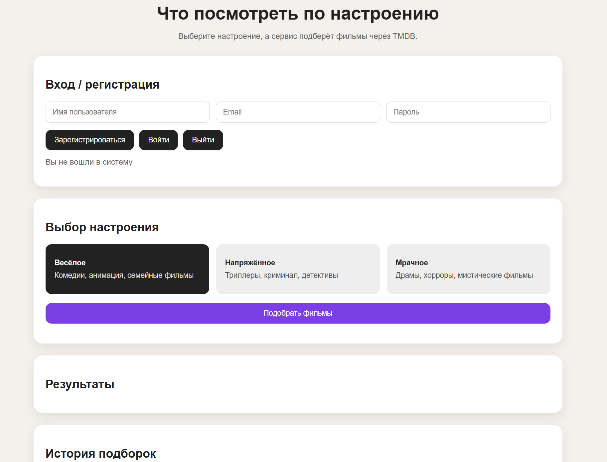
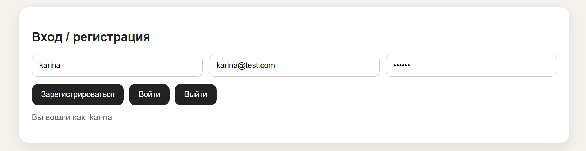
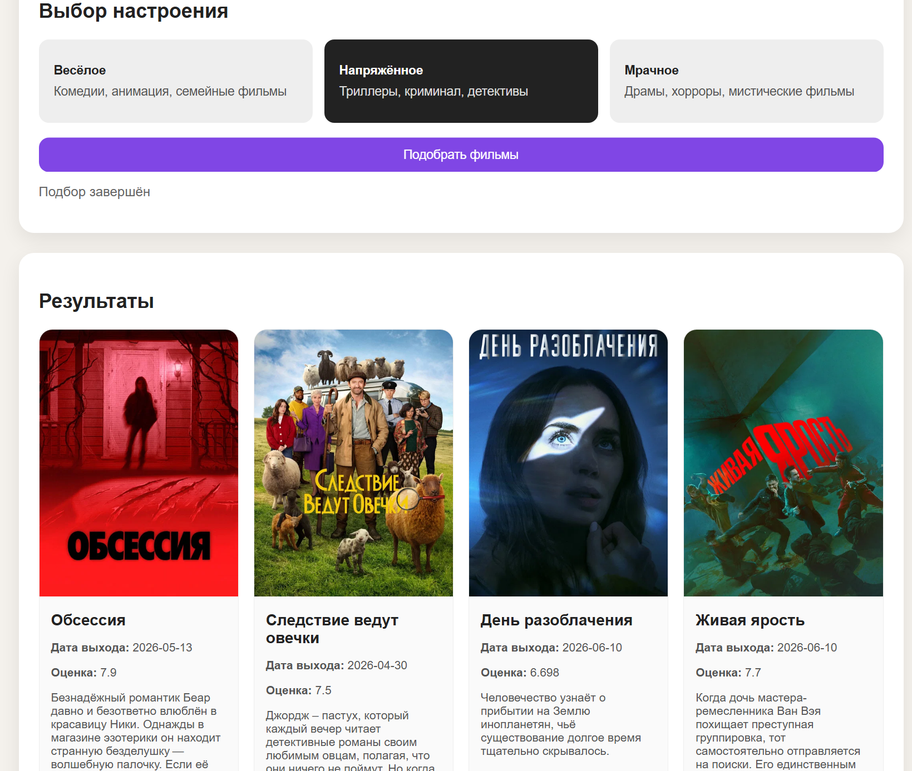

# Mood Movie Application

Веб-сервис «Что посмотреть по настроению» — приложение для подбора фильмов по эмоциональному состоянию пользователя. Пользователь выбирает одно из доступных настроений, после чего система преобразует его в параметры поиска и получает список фильмов через TMDB API.

Проект реализован как Spring Boot веб-приложение с REST API, PostgreSQL, статическим HTML/CSS/JavaScript интерфейсом, Swagger UI и unit-тестами.

---

## Основной функционал

В приложении реализованы следующие возможности:

1. Регистрация нового пользователя.
2. Вход пользователя в систему.
3. Выход из системы.
4. Выбор настроения из фиксированного набора:

   * `HAPPY` — весёлое настроение;
   * `TENSE` — напряжённое настроение;
   * `DARK` — мрачное настроение.
5. Создание подборки фильмов по выбранному настроению.
6. Получение фильмов через TMDB API.
7. Отображение результата в виде карточек фильмов.
8. Сохранение подборки и найденных фильмов в PostgreSQL.
9. Просмотр истории подборок текущего пользователя.
10. Открытие ранее созданной подборки.
11. Сохранение выбранной подборки.
12. Удаление подборки.
13. Обработка ошибок авторизации, некорректных данных и ошибок внешнего API.
14. Просмотр REST API через Swagger UI.

---

## Стек технологий

В проекте используется следующий стек:

* Java 17;
* Spring Boot 3.3.5;
* Spring Web;
* Spring Data JPA;
* Hibernate;
* PostgreSQL;
* Spring Security Crypto для BCrypt-хеширования паролей;
* TMDB REST API;
* Jackson;
* Swagger / Springdoc OpenAPI;
* HTML;
* CSS;
* JavaScript;
* Maven;
* JUnit 5.

---

## Архитектура приложения

Проект разделён на несколько логических слоёв:

```text
controller  — REST-контроллеры;
service     — бизнес-логика приложения;
strategy    — правила подбора фильмов по настроению;
tmdb        — интеграция с внешним API TMDB;
repository  — доступ к базе данных через Spring Data JPA;
entity      — JPA-сущности;
dto         — объекты запросов и ответов для frontend;
exception   — обработка ошибок;
static      — пользовательский интерфейс;
test        — unit-тесты.
```

Основной поток выполнения:

```text
Пользователь открывает http://localhost:8092
        ↓
Frontend отправляет REST-запрос
        ↓
Controller принимает запрос
        ↓
Service выполняет бизнес-логику
        ↓
MoodStrategyFactory выбирает стратегию по настроению
        ↓
TmdbMovieDataAdapter вызывает TmdbHttpClient
        ↓
TmdbHttpClient получает фильмы из TMDB API
        ↓
JPA repositories сохраняют подборку и фильмы в PostgreSQL
        ↓
Frontend отображает карточки фильмов и историю подборок
```

---

## Основные классы проекта

### `MoodMovieApplication`

Главный класс запуска Spring Boot приложения. Он запускает Spring-контекст и поднимает встроенный сервер Tomcat.

### `RegistryController`

REST-контроллер для регистрации, входа, выхода и получения текущего пользователя.

Основные endpoints:

```http
POST /api/registry/register
POST /api/registry/login
POST /api/registry/logout
GET  /api/registry/me
```

Контроллер вызывает `RegistryService` и сохраняет id пользователя в HTTP-сессии.

### `SelectionController`

REST-контроллер для работы с подборками фильмов.

Основные endpoints:

```http
POST   /api/selections
GET    /api/selections
GET    /api/selections/{id}
POST   /api/selections/{id}/save
DELETE /api/selections/{id}
```

Контроллер проверяет авторизацию пользователя через сессию и передаёт выполнение в `SelectionFacade`.

### `RegistryService`

Сервис регистрации и авторизации. Проверяет корректность username, email и password, контролирует уникальность username/email, хеширует пароль через BCrypt и выполняет проверку пароля при входе.

### `SelectionFacade`

Главный сервис подбора фильмов. Он создаёт подборку, устанавливает статус `RUNNING`, выбирает стратегию по настроению, формирует параметры поиска TMDB, получает список фильмов, сохраняет результат и меняет статус подборки на `COMPLETED`. Если возникает ошибка, подборка сохраняется со статусом `ERROR`.

### `MoodStrategyFactory`

Фабрика стратегий. Получает настроение пользователя и возвращает нужную стратегию подбора.

### `HappyMoodStrategy`, `TenseMoodStrategy`, `DarkMoodStrategy`

Стратегии подбора фильмов. Каждая стратегия задаёт свои жанры TMDB, минимальную оценку, язык ответа, сортировку и номер страницы.

### `TmdbHttpClient`

Клиент для обращения к TMDB API. Формирует URL для `/discover/movie`, выполняет HTTP-запрос, обрабатывает статусы ответа и преобразует JSON-ответ TMDB в DTO фильмов.

### `TmdbMovieDataAdapter`

Адаптер между бизнес-логикой приложения и TMDB-клиентом. Преобразует данные, полученные из TMDB, в сущности `SelectedMovie`.

### `SelectionMapper`

Преобразует JPA-сущность `MovieSelection` в DTO `SelectionResponse`, который отправляется на frontend.

---

## База данных

В качестве СУБД используется PostgreSQL.

Основные таблицы:

* `users` — пользователи приложения;
* `movie_selections` — созданные подборки фильмов;
* `selected_movies` — фильмы, входящие в конкретную подборку;
* `external_api` — информация об обращениях к TMDB API.

### `users`

Хранит данные зарегистрированных пользователей.

Основные поля:

```text
id
username
email
password_hash
created_at
```

### `movie_selections`

Хранит подборки фильмов, созданные пользователями.

Основные поля:

```text
id
user_id
mood
status
rules_json
error_message
saved
created_at
completed_at
```

### `selected_movies`

Хранит фильмы, которые вошли в подборку.

Основные поля:

```text
id
selection_id
tmdb_id
title
overview
release_date
poster_path
vote_average
genres_json
```

### `external_api`

Хранит информацию об обращениях к TMDB API.

Основные поля:

```text
id
selection_id
endpoint
request_url
http_status
success
error_message
created_at
```

---

## Запуск приложения

### Требования

Перед запуском должны быть установлены:

* Java 17 или выше;
* Maven;
* PostgreSQL;
* доступ к TMDB API.

### 1. Создать базу данных

```bash
createdb -U postgres moodmovie
```

### 2. Настроить подключение

Файл:

```text
src/main/resources/application.properties
```

Пример настроек:

```properties
spring.application.name=MoodMovieApplication

server.port=8092

spring.datasource.url=jdbc:postgresql://localhost:5432/moodmovie
spring.datasource.username=postgres
spring.datasource.password=13579

spring.jpa.hibernate.ddl-auto=update
spring.jpa.show-sql=true
spring.jpa.properties.hibernate.format_sql=true
spring.jpa.database-platform=org.hibernate.dialect.PostgreSQLDialect

tmdb.api.key=YOUR_API_KEY

springdoc.swagger-ui.path=/swagger-ui.html
```

Перед запуском нужно заменить `YOUR_API_KEY` на ключ TMDB.

### 3. Собрать проект

```bash
mvn clean package
```

### 4. Запустить приложение

```bash
java -jar target/moodmovieapplication-0.0.1-SNAPSHOT.jar
```

### 5. Открыть приложение

```text
http://localhost:8092
```

### 6. Открыть Swagger UI

```text
http://localhost:8092/swagger-ui.html
```

---

## Пользовательский интерфейс

Пользовательский интерфейс расположен в:

```text
src/main/resources/static
```

Основные файлы:

```text
index.html — структура страницы;
style.css  — оформление;
app.js     — логика взаимодействия с backend.
```

Интерфейс позволяет пользователю зарегистрироваться, войти в систему, выбрать настроение, запустить подбор фильмов, увидеть результат в виде карточек и открыть историю ранее созданных подборок.

---

## Использованные паттерны проектирования

### Strategy

Паттерн используется для разделения правил подбора фильмов по настроениям.

Классы:

```text
MoodStrategy
HappyMoodStrategy
TenseMoodStrategy
DarkMoodStrategy
```

Каждая стратегия задаёт свои параметры поиска для TMDB API.

### Factory

Паттерн используется для выбора нужной стратегии по настроению.

Класс:

```text
MoodStrategyFactory
```

Если пользователь выбирает настроение `HAPPY`, фабрика возвращает `HappyMoodStrategy`; если `TENSE` — `TenseMoodStrategy`; если `DARK` — `DarkMoodStrategy`.

### Adapter

Паттерн используется для отделения бизнес-логики приложения от конкретной реализации TMDB-клиента.

Классы:

```text
MovieDataProvider
TmdbMovieDataAdapter
TmdbHttpClient
```

Приложение работает с интерфейсом `MovieDataProvider`, а адаптер преобразует ответ TMDB в объекты `SelectedMovie`.

### Facade

Класс `SelectionFacade` выступает как фасад для основного сценария подбора фильмов. Он объединяет работу с пользователем, стратегиями, TMDB API, базой данных, статусами подборки и DTO-ответом для frontend.

---

## Тестирование

В проекте реализованы unit-тесты для ключевых компонентов приложения.

Запуск всех тестов:

```bash
mvn test
```

Основные тестовые классы:

### `RegistryServiceTest`

Проверяет регистрацию и вход пользователя:

* успешная регистрация;
* ошибка при коротком пароле;
* ошибка при повторяющемся username;
* успешный вход с корректным паролем;
* ошибка при неверном пароле.

### `MoodStrategyTest`

Проверяет правила подбора фильмов:

* параметры для весёлого настроения;
* параметры для напряжённого настроения;
* параметры для мрачного настроения;
* выбор стратегии через `MoodStrategyFactory`.

### `SelectionMapperTest`

Проверяет преобразование подборки в DTO-ответ:

* маппинг завершённой подборки;
* маппинг фильмов в карточки;
* маппинг подборки со статусом ошибки.

### `TmdbHttpClientParsingTest`

Проверяет обработку JSON-ответа TMDB:

* корректный парсинг списка фильмов;
* возврат пустого списка при отсутствии `results`;
* ограничение результата до 10 фильмов.

---

## Тест-кейсы

### ТК-1: Регистрация нового пользователя

| Параметр            | Значение                                                                                                                                                     |
| ------------------- | ------------------------------------------------------------------------------------------------------------------------------------------------------------ |
| Предусловие         | Приложение запущено, пользователь с таким username/email отсутствует                                                                                         |
| Шаги                | 1. Открыть `http://localhost:8092`<br>2. Ввести username<br>3. Ввести email<br>4. Ввести пароль длиной не менее 6 символов<br>5. Нажать «Зарегистрироваться» |
| Ожидаемый результат | Пользователь сохраняется в таблицу `users`, пароль сохраняется в виде BCrypt-хеша, на странице отображается сообщение «Вы вошли как: username»               |

### ТК-2: Ошибка при коротком пароле

| Параметр            | Значение                                                                                                      |
| ------------------- | ------------------------------------------------------------------------------------------------------------- |
| Предусловие         | Приложение запущено                                                                                           |
| Шаги                | 1. Ввести username<br>2. Ввести email<br>3. Ввести пароль короче 6 символов<br>4. Нажать «Зарегистрироваться» |
| Ожидаемый результат | Пользователь не создаётся, frontend отображает сообщение «Пароль должен содержать минимум 6 символов»         |

### ТК-3: Вход пользователя

| Параметр            | Значение                                                                                                                                |
| ------------------- | --------------------------------------------------------------------------------------------------------------------------------------- |
| Предусловие         | Пользователь уже зарегистрирован                                                                                                        |
| Шаги                | 1. Ввести username<br>2. Ввести пароль<br>3. Нажать «Войти»                                                                             |
| Ожидаемый результат | Система находит пользователя, проверяет пароль через BCrypt, сохраняет `userId` в HTTP-сессии и отображает имя пользователя на странице |

### ТК-4: Подбор фильмов по весёлому настроению

| Параметр            | Значение                                                                                                                                         |
| ------------------- | ------------------------------------------------------------------------------------------------------------------------------------------------ |
| Предусловие         | Пользователь авторизован, TMDB API доступен                                                                                                      |
| Шаги                | 1. Выбрать настроение «Весёлое»<br>2. Нажать «Подобрать фильмы»<br>3. Дождаться завершения обработки                                             |
| Ожидаемый результат | Создаётся запись в `movie_selections` со статусом `COMPLETED`, в `selected_movies` сохраняются фильмы, на странице отображаются карточки фильмов |

### ТК-5: Подбор без авторизации

| Параметр            | Значение                                                                                   |
| ------------------- | ------------------------------------------------------------------------------------------ |
| Предусловие         | Пользователь не вошёл в систему                                                            |
| Шаги                | 1. Открыть главную страницу<br>2. Выбрать любое настроение<br>3. Нажать «Подобрать фильмы» |
| Ожидаемый результат | Подборка не создаётся, система возвращает ошибку «Пользователь не авторизован»             |

### ТК-6: Просмотр истории подборок

| Параметр            | Значение                                                                                                                                            |
| ------------------- | --------------------------------------------------------------------------------------------------------------------------------------------------- |
| Предусловие         | Пользователь авторизован и ранее создавал подборки                                                                                                  |
| Шаги                | 1. Нажать «Обновить историю»                                                                                                                        |
| Ожидаемый результат | Frontend отправляет `GET /api/selections`, на странице отображается список подборок пользователя с id, настроением, статусом и признаком сохранения |

### ТК-7: Ошибка при недоступности TMDB API

| Параметр            | Значение                                                                                                                            |
| ------------------- | ----------------------------------------------------------------------------------------------------------------------------------- |
| Предусловие         | Пользователь авторизован, TMDB API недоступен или указан неверный API key                                                           |
| Шаги                | 1. Выбрать настроение<br>2. Нажать «Подобрать фильмы»                                                                               |
| Ожидаемый результат | Подборка сохраняется со статусом `ERROR`, в поле `error_message` сохраняется причина ошибки, пользователь видит сообщение об ошибке |

### ТК-8: Выход из системы

| Параметр            | Значение                                                                                                                   |
| ------------------- | -------------------------------------------------------------------------------------------------------------------------- |
| Предусловие         | Пользователь авторизован                                                                                                   |
| Шаги                | 1. Нажать «Выйти»                                                                                                          |
| Ожидаемый результат | Frontend отправляет `POST /api/registry/logout`, HTTP-сессия завершается, на странице отображается «Вы не вошли в систему» |

---

## Структура проекта

```text
moodmovieapplication
├── pom.xml
├── README.md
├── src
│   ├── main
│   │   ├── java
│   │   │   └── mephi
│   │   │       └── moodmovieapplication
│   │   │           ├── MoodMovieApplication.java
│   │   │           ├── controller
│   │   │           ├── dto
│   │   │           ├── entity
│   │   │           ├── exception
│   │   │           ├── repository
│   │   │           ├── service
│   │   │           ├── strategy
│   │   │           └── tmdb
│   │   └── resources
│   │       ├── application.properties
│   │       └── static
│   │           ├── index.html
│   │           ├── style.css
│   │           └── app.js
│   └── test
│       └── java
│           └── mephi
│               └── moodmovieapplication
│                   ├── mapper
│                   ├── service
│                   ├── strategy
│                   └── tmdb
```

---

## Демонстрационный сценарий

Для демонстрации проекта можно выполнить следующий сценарий:

1. Запустить приложение.
2. Открыть `http://localhost:8092`.
3. Зарегистрировать нового пользователя.
4. Выбрать настроение «Весёлое».
5. Нажать «Подобрать фильмы».
6. Дождаться отображения карточек фильмов.
7. Нажать «Обновить историю».
8. Открыть созданную подборку из истории.
9. Сохранить подборку.
10. Проверить данные в таблицах `users`, `movie_selections` и `selected_movies`.

---

## Скриншоты

Ниже приведены скриншоты работы приложения.

**Рис. 1. Главная страница приложения**


**Рис. 2. Авторизация пользователя**


**Рис. 3. Результаты подбора фильмов**



---

## Git

Разработка велась с использованием Git. Репозиторий содержит ветки `main` и `dev`. Коммиты отражают основные этапы разработки: создание структуры проекта, добавление сущностей, подключение PostgreSQL, реализацию регистрации, интеграцию с TMDB, создание frontend, добавление тестов и документации.

---

## Итог

Проект Mood Movie Application позволяет пользователю получить подборку фильмов по выбранному настроению. Приложение объединяет frontend, REST API, PostgreSQL, интеграцию с TMDB и паттерны проектирования. Результаты подбора сохраняются в базе данных, поэтому пользователь может просматривать историю и возвращаться к ранее созданным подборкам.
